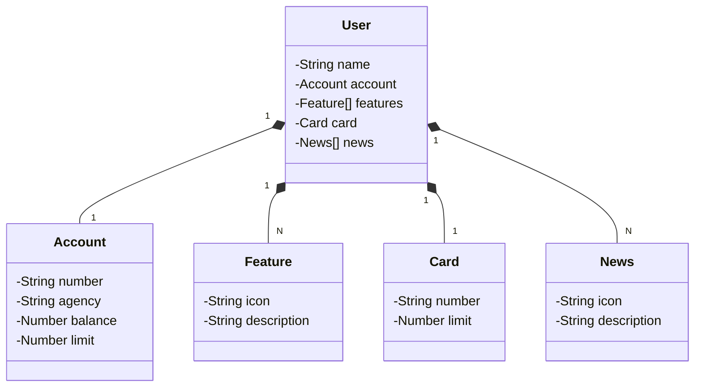

Projeto - API REST com Java Spring Boot

# Para criação do Projeto:

* Spring Initializr: https://start.spring.io/

* Gradle - Groovy -> Gerenciador de dependências;

* Dependências:
    * Spring Web;
    * Spring Data JPA;
    * H2 Database;
    * PstgresSQL Driver;

* Usar o ChatGPT para criar um diagrama MERMAID. Importar no Github para ele apresentar já um diagrama de classes com base no mermaid.

######

######

* Para conferir se o nosso banco de dados está rodando no navegador:
localhost:8080/h2-console

* Para visualizar a API utilizando o Swagger:
http://localhost:8080/swagger-ui/index.html

* Para publicar a API na nuvem - Railway
railway.app
